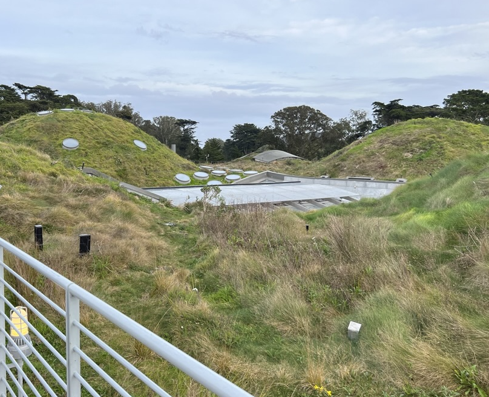

## The Living Roof on the California Academy Of Sciences

On 6th Jan 2023, I had the opportunity to visit the [California Academy of Sciences](https://www.calacademy.org) in San Fransisco.  Intrestingly, as we soon discovered, there was a whole proper micro-ecosystem on the roof.

**California Academy Of Sciences** is a research institute and natural history museum that is one of the largest museums of natural history in the world, housing more than 46 million specimens.

<!-- more -->

---

## Reasons why the California Academy Of Sciences has a living roof

1. Living roofs can dramitcally cool builidings, reducing the need for air conditioning.

2. Living roofs reduce the unhealthy gas levels in the area.

3. Living roofs give an oppurtunity for some to see more than just bricks and concrete, but also to see grasses, trees, etc.

4. Living roofs are easier to maintain than normal roofs

5. Lastly, but not least, living roofs are aesthetically pleasing and help bring more visitors to the building.

---
## Summary

I strongly recommend visiting the science mueseum. Besides the living roof (which itself is a very great part), there are also other things that people of different interests can enjoy. 

See you!