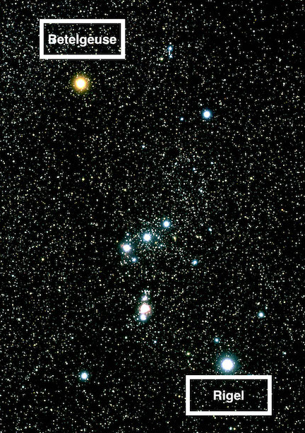

## How Are Stars Classified?

Stars are classified based on their visual traits, like colour, and phyisical traits, like size and mass. **Star Classification** is a way to classify stars, either based on their colour and/or size and mass.  Since stars have so much variety in between them, classifying stars allows astronomers to find a star with certain characteristics much easier.  Astronomers also classify stars in order to better understand the different types of stars in both our galaxy and our universe.

<!-- more -->

---

## Why is classification needed? 
Astronomers classify stars in order to make it easier to find a specific star amongst millions and to better understand different stars within the universe.

## Classification 

### Color based
One way of classifying stars is based on their colour. The different classifications of stars based off their colour:

1. M: Red Stars
2. K: Orange Stars
3. G: Yellow Stars
4. F: Yellowish-White Stars
5. A: White Stars
6. B: Blue-White Stars
7. O: Blue Stars

### Size/Mass based

Another way of classifying stars is based on their size and/or mass. The different classifications of stars based off their size &/or mass:

1. Dwarfs: "Smaller" stars that make up the magority of stars in the universe.  Are almost always in main sequence.
2. Giants:  Larger stars that tend to be the aged phase of dwarf stars.  Are rarely main sequence.
3. Supergiants:  Even larger stars that are the aged phase of Giant stars.  Are only main sequence for O & B type stars.
4. Hypergiants:  Extremely large stars that are the aged phase of O & B supergiants.  They are basically just supergiants on overdrive.

### Blended Classifications 

In reality, these classifications are combined in order to ensure no overlaps. For example, in the constellation Orion, the star Betelgeuse is a "M-type Supergiant" star, and the star Rigel is a "B-type Supergiant".

---
## Summary

Stars are classified in many ways, which can help if one star needs to be found out of a datapool of millions.  

Thank you for reading this blog! If you want to research further into these subjects, I would suggest [visiting](https://universe.nasa.gov/stars/types/).